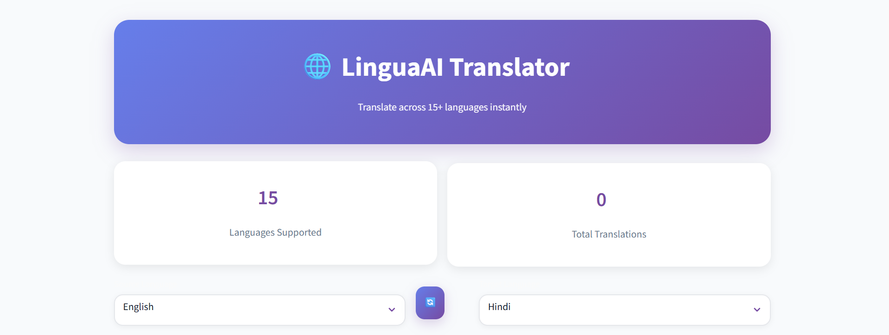
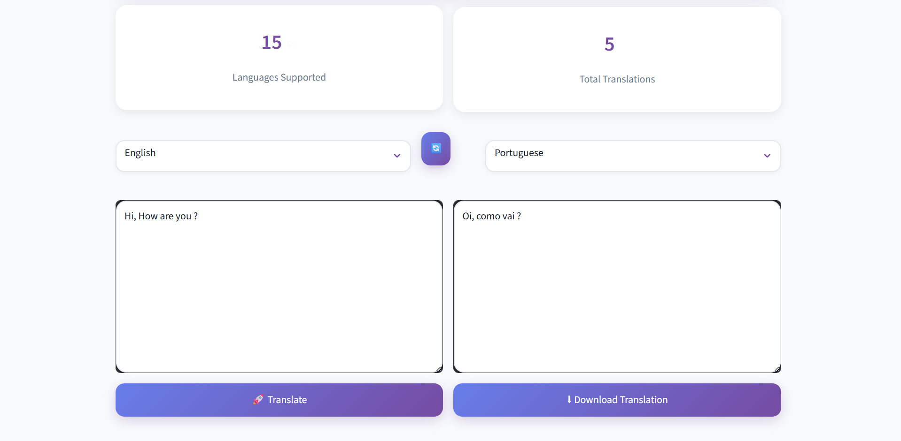
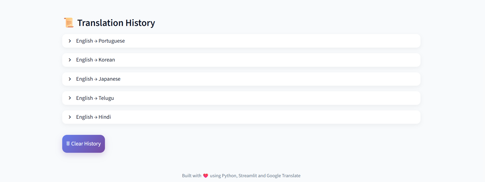

# LinguaAI Translator

A modern language translation web app built using Streamlit and Deep Translator.

## Features

- Translate text into 15+ languages
- Clean and responsive UI
- Translation history
- Fast and simple interface

## Tech Stack

- Python
- Streamlit
- Deep Translator

## Run Locally

```bash
pip install -r requirements.txt
streamlit run app.py

## Home Page



## Translation Result



## History Feature


